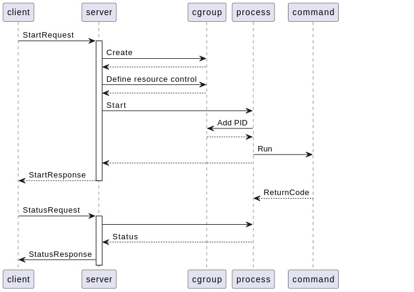
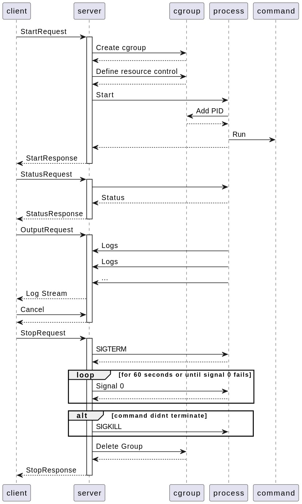

# RFD 1 - Job Worker

## Required Approvers

Engineering: @Stephen Levine | @Trent Clarke | @david | @jim

## What

Design document for detailing the job worker service to run arbitrary linux commands on remote hosts. The service contains three components, a reusable go library, a gRPC server and a CLI using a gRPC client. Clients can start "jobs" that run a linux command and manage them by querying there status, stream the output or stopping them from executing. Additionally the job provides options to add resource controls for CPU, memory and IO.

## Why

Container systems are great, they allow you to run processes on other machines and often handle things like resource control. Unfortunately not every machine has a running container system and orchestrating the running of a container over a network can have an overhead for simple jobs.

This library can be used to execute arbitrary linux commands on a machine and provide basic resource control for the process using cgroups. This can be of use if a server on a network somewhere needs to run adhoc commands for a user but does not have something like docker running. 

For instance this could be used as a way to share compute resources amongst a team of software engineers. If a team of 8 engineers have a x4large instance for a development server, they could easily share the compute resources between the members. Some commands might be very long lived, such as soak tests, monitoring etc. so specifying resource per job can be very beneficial.

## Details

### Terminology

 - Job Worker: Linux process executing the golang binary running the jobworker library
 - Job: Linux process being executed by Job Worker
 - Owner: Client ID (common name of the tls client cert) that started a Job

### Security

Possible attack vectors include:
 - DDOS attacks. Since the commands are arbitrary a malicious client may send many resource hungry commands
 - Privilege escalation. Since the golang library needs to have permissions on the unix system to manage cgroups, care needs to be placed on not allowing job's to escalate there privilege on the host
 - Starting servers listening over a network for remote commands, bypassing the auth of the gRPC server

If used in production the host running jobworker would need strict network firewalls to prevent access over the network. For example take this simple command to execute for jobworker, `nc -kl 4444 | bash`. This would start a TCP server and pipe the contents into an bash session. If network controls were not taken seriously, another "job" on the machine or even worse a machine on the same network, has shell access to the underlying process's environment without auth.

The main attack surface of the project is the gRPC service itself. Although it is using mutual auth, strong crypto algorithms need to be used, such as using TLS v1.3, to ensure secure communication. Otherwise a man in the middle attack is possible even using certs.

Another attack surface is the linux process being started as a job. Since the command will be executed on behalf of the client by the job worker, which has access to cgroups, the environment in which the job inherits and how it is set up needs to be done securely, i.e. not inherit the environment variables or working directory of it's parent (the job worker). Additionally this linux process could send signals such as `SIGKILL` using a command such as `pkill` to manipulate other processes on the system, ensuring the process is being run on a child process with appropriate permissions is vital.

#### Authorization

Authentication will be provided by TLS mutual auth, where the client and server will exchange certs over TLS v1.3. Authorization is then provided by using the common name in the client cert as the client ID. Once authenticated any client can create a job, returning a job UUID. This client ID is treated as the "owner" and the job worker will maintain this ID alongside the job. For all other commands, the client ID will be checked against the job to ensure the client is the "owner" of the job and has permission to manage the job.

The authorization scheme for the gRPC service will be implemented using a gRPC interceptor. This interceptor will be used for all requests to the gRPC service. It will extract the common name of the client certificate and use this as the client ID, as adding it to the request's context. If the request contains a job UUID, the client ID will be used to check the client is the "owner" of the job. If it matches the authz passes, if not an unauthorized error will be sent.

#### TLS

Since there are no requirements for older versions of TLS to be supported, TLS v1.3 will be made a minimum. TLS v1.3 is more secure than v1.2 and drops a lot of less secure ciphers. In golang ciphers cannot be specified for TLS v1.3 so we will leave this blank in the tls.Config. If TLS v1.2 is needed for compatibility, then the cipher list does need to be limited and I would typically use the ciphers specified in the "modern" section of https://developers.cloudflare.com/ssl/reference/cipher-suites/recommendations/ or https://ssl-config.mozilla.org/#server=go&version=1.14.4&config=modern&hsts=false&guideline=5.7 with cipher strengths more than 256 bit.

### gRPC

In this PR there is a `worker.proto` file specifying the RPC service and it's messages. These effectively wrap the golang libraries functionality. A gRPC server will be developed importing the library and offering the endpoints to the CLI client.

#### Streaming approach

When starting a job the cmd.Exec will map the STDOUT and STDERR to a file. When the client requests the output stream, the gRPC endpoint can then tail the contents of the file and pipe it through the gRPC response stream to the client. The advantage to this approach is simplicity, the go standard library then handles concurrent writing of STDOUT and STDERR to the file. Concurrent reading then becomes as easy as tailing the file and piping the response through the gRPC stream. Since level 4 did not need resource isolation for mount and PID namespaces, this has not been implemented, but this would need to be done in production to isolate the log of each Job. The disadvantages of this method is that it does not handle log rotations, in the event the process is very long lived or produces many logs. In this case the stream may end and the user could be required to cancel and re run the command.

### Process execution life cycle

Together with this design doc there are two UML sequence diagrams showing a happy and un happy scenario.



In the unhappy scenario a gRPC client sends a start request to the server. The server then uses the library to first create a cgroup to execute the job, adds the resource control parameters in the appropriate interface files for the cgroup controllers, then starts the job's process. This process is not the client's command, but a simple process that adds it's own PID to the cgroup. This prevents a race condition where the client's command is executed then the PID is found and added, since the command may already abuse resources before the cgroup has a chance to control them. Once the PID is added the command is run in the process. After this the server responds to the client. In this un happy scenario, we assume the command fails quickly and returns an error code. The client then uses the ID in the response to query the status of the job. Since the server has access to the underlying exec.Cmd and therefore os.Process we can return the status along with the return code to the user with the Running bool as false.



The happy scenario is the same for starting a job. Here we assume the command has not yet returned and is executing, so the status response returns Running true. Therefore the client can now use the ID again to stream the logs of the job. After streaming for a period of time the client can cancel the stream. If the client then decides to stop the job it can send the ID to the server and the server can forcefully close the process using os.Process.Kill. Once killed the cgroup is deleted and a response sent to the client.

### Process model

When the jobworker starts a process, instead of executing the command, it first starts an init script (`job` in diagram) to add it's own PID to the cgroup. This ensures that when the command is executed, it already has the resource controls active. Also this provides a convenient PID to use for the process group so that if we need to kill any processes for a job, all child processes can be tracked.

```
        jobwoker
       /   |   \
     job  job  job
      |
     cmd
     / \
    cat ps
    ...
 ```

### CLI UX

A CLI client will be implemented using a gRPC client communicating over mTLS to the gRPC server, wrapping the go library. Below is an example of how to use the CLI

```bash
worker help
> worker {action} {args}
> action is either start, stop, status, logs and help
> the only action with args is start, which takes the linux command to run.

worker start bash -c "while true; do echo hello; sleep 2; done"
> 667752ba-4cbb-44eb-adad-5b324c8204bc

worker status 667752ba-4cbb-44eb-adad-5b324c8204bc
>   Job Status
>	ID          667752ba-4cbb-44eb-adad-5b324c8204bc
>	Owner       client1
>	PID         387
>	Running     true
>	ExitCode    
>	ReturnError 

worker stream 667752ba-4cbb-44eb-adad-5b324c8204bc
> hello
> hello
Ctrl+C

worker stop 667752ba-4cbb-44eb-adad-5b324c8204bc

worker status 667752ba-4cbb-44eb-adad-5b324c8204bc
>   Job Status
>	ID          667752ba-4cbb-44eb-adad-5b324c8204bc
>	Owner       client1
>	PID         387
>	Running     false
>	ExitCode    0
>	ReturnError 
```

### Golang Usage

Please see `doc.go` for an annotated list of types and interfaces the go library will provide. Below is an example of how the library could be used

```golang
package main

import (
    "log"
    "bufio"
    "os/user"
    "pkg/jobworker"
)

func main() {
    worker := jobworker.New()

    cmd := "while true; do echo hello; sleep 2; done"

    // In the gRPC server the user ID would be extracted from the common name of the client tls cert
    // For this example we simply use the current linux user
    user, err := user.Current()
    if err != nil {
        log.Error(err)
        return
    }

    id, err := worker.Start(user.UserName, cmd, JobOpts{100, "100M", "50ms"})
    if err != nil {
        log.Error(err)
        return
    }

    status, err := worker.Status(id)
    if err != nil {
        log.Error(err)
        return
    }

    if !status.Running {
        log.Error("job not running")
        return
    }

    reader, err := worker.Output(id)
    if err != nil {
        log.Error("could not get reader for job's output")
        return
    }

    scanner := bufio.NewScanner(reader)
    for scanner.Scan() {
        line := scanner.Text()
        log.Printf("%s\n", line)
    }

    err = worker.Stop(id)
    if err != nil {
        log.Error(err)
        return
    }
}
```

### Audit Events

Since the jobworker could be executing linux commands on behalf of a client some events would be useful for auditing purposes, similar to what you would expect with a production SSH server. Although not implemented in this example for brevity, the type of events emitted in a production system could be:

 - start
 - stop

along with the "owner" and "command" that they executed. This can be useful not only to know what clients are executing but also counting how many commands a client is executing or determine the most common commands. These type of events could also help detect DDOS attacks or identify unknown / blacklisted clients.

### Observability

Since the jobworker would expose a gRPC server, in production this server should expose a health endpoint for monitoring purposes. In addition to this a metric such as "running jobs" would be useful to know how many jobs the jobworker is currently running. This could be used to trigger warnings if too many commands are seen (identifying a DDOS attack), too many clients, or new clients, are executing commands over a window of time etc.

### Product Usage

Product usage can be inferred from the audit events, where the number of clients and number of jobs should justify the service's usage.

### Test plan

In addition to unit tests covering the library and gRPC server/client and integration test covering the mTLS connection, a few manual tests should be performed to cover the functional requirements.

At the very least, the jobworker should be able to:

 1. Start a job using `sleep 10` then query the status before and after 10 seconds, ensuring the Job's running state is true and then false. Try to stop the job after 10 seconds and expect an error saying the job has already complete.

 2. Start a job that wont return, i.e. `while true; do echo hello; sleep 2; done` and query the status to ensure it's running and note the process ID. Stream the output of the job and ensure you see `hello` every two seconds. Then stop the job and ensure the process ID is not active.

 3. Try to stop, get a status and stream the output of a job using an invalid ID and expect an error saying the job could not be found for all.

 4. Try to stop a job started by another client. Start a job as client A, get the UUID then try run the stop gRPC as client B using the UUID. You should expect an error saying the job is not found. This is for security reasons as client B should not be told the UUID is valid at all. Then stop the job using client A and expected a success.

### Trade offs / Limitations

 - Using self signed certs stored in vsc. The CA should come from something like AWS ACM or on a private signing server in a DMZ and loaded into memory securely. If this was running on AWS EKS using secrets manager for example.
 
 - jobworker is not highly available, if the gRPC service fails and starts again it looses the in memory list of processes. Additionally if the server process fails then all jobs will become orphaned processes. If the list of jobs with there PID and owner ID were instead in a database, the gRPC server could simply read the list from storage and continue serving requests. Although this does not solve the problem of the processes being orphaned, which would need to be reclaimed by the new job worker process.
 
 - jobworker is not scalable, it assumes only a single instance. To make it scalable the gRPC authz could use the database mentioned above to maintain "owners", then the service could be sharded so each gRPC server maintains a set of processes. A load balancer would then need to be used to spread the load between the servers and also manage which server has which clients. Sticky sessions could help keep clients talking to the servers that manage there client's processes. Another solution would be for another service to proxy the connection and determine which shard has the client using something like a "gossip" protocol, similar to mongoDB.

 - A "list" command was not implemented for brevity, it was not in the requirements but ideally the client would not need to keep track of the UUIDs of it's jobs. Instead adding an action "list" to the CLI / go library and gRPC server to return a list of job UUIDs for a given client would be useful for many scenarios.

 - TLS v1.3 was used since it was assumed that the client server would be running in a cloud environment and not need much compatibility.

 - No set up has occurred on the host running the server so performance issues would be expected if run at scale. Often linux will have restrictions on the number of processes or open file descriptors a user can have. Those two come to mind immediately but load testing would need to be performed to likely tune other parameters on the system.

 - jobworker does not calculate the total requested resources (CPU, memory, IO) for all jobs, does not exceed the system. cgroup controllers provide interface files to give system maximums. In production these would need to be checked to ensure jobs are not requested over the max.

 - No rate limiting has been used. A client could accidentally DOS the system by requiring too many jobs with resource controls. In production a gRPC interceptor could be used to implement a rate limiting algorithm such as leaky bucket.

 - Logs are stored on the file system. For this challenge I think the logs would have needed to either be in memory or on a file system. In production these logs could be stored in a database with good performance for large log files such as elastic search.
